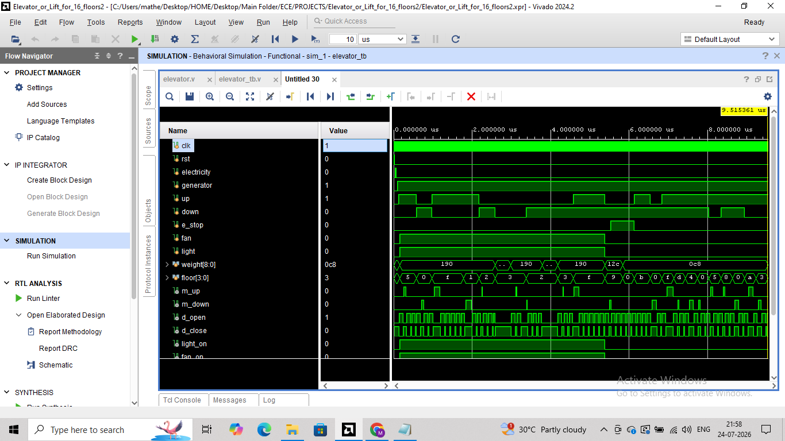

# 🛗 Smart Elevator Controller for 16 floors using FSM (Verilog)

## 📌 Project Overview

This project implements a **Smart Elevator Controller** using a Finite State Machine (FSM) in Verilog.
The design simulates real-world elevator behavior including:

* 🏢 Multi-floor navigation
* ⚡ Power failure handling (Electricity / Generator)
* ⚖️ Overweight detection with alarm
* 🚨 Emergency stop handling
* 🚪 Automatic door control with timer
* 💡 Fan & light control inside elevator

The system ensures **safe, efficient, and reliable elevator operation** under various real-world scenarios.

---

## ⚙️ Features

* ✅ Automatic floor movement (Up / Down)
* 🚪 Door open/close control with timing
* ⚖️ Overweight detection (Alarm if weight ≥ 500)
* 🚨 Emergency stop functionality
* ⚡ Power failure handling with generator backup
* 💡 Fan and light control
* 🔄 Handles conflicting inputs (Up & Down together)
* 🧪 Fully verified using detailed testbench

---

## 🧠 FSM States

| State               | Description                   |
| ------------------- | ----------------------------- |
| `IDLE`              | Elevator waiting for request  |
| `MOVE_UP`           | Moving upwards                |
| `MOVE_DOWN`         | Moving downwards              |
| `DOOR_OPEN`         | Door is open                  |
| `DOOR_CLOSE`        | Door is closing               |
| `WEIGHT_CHECK`      | Checks overload condition     |
| `ALARM`             | Overweight condition          |
| `EMERGENCY_STOP`    | Emergency halt                |
| `ELECTRICITY_CHECK` | Waiting for power restoration |

---

## ⚡ Power Handling

* If **electricity = 0** and **generator = 0**
  → Elevator enters `ELECTRICITY_CHECK` state

### Behavior:

* When power returns → resumes previous state
* Ensures safe operation during power failure

---

## ⚖️ Overweight Handling

* Condition:

  ```
  weight ≥ 500
  ```

### Behavior:

* Elevator does NOT move
* Alarm is triggered
* Returns to normal only after weight reduces

---

## 🚨 Emergency Handling

* Trigger:

  ```
  e_stop = 1
  ```

### Behavior:

* Elevator stops immediately
* Transitions to safe state
* Door opens for safety

---

## 🚪 Door Control Logic

* Door opens when elevator reaches target floor
* Remains open for fixed duration using counter
* Automatically closes after timeout

---

## ⏱️ Timing Behavior

```
Door open time ≈ 10 clock cycles
```

---

## 📂 Project Structure

```text
elevator-controller-fsm/
│
├── elevator.v                 # RTL Design (FSM-based Elevator Controller)
├── elevator_tb.v              # Testbench with multiple test cases
├── README.md
├── simulation_log.txt         # Console output ($display results)
└── images/
    └── waveform.png           # Simulation waveform
```

---

## 🧪 Testbench Description

The testbench verifies multiple real-world scenarios:

### ✔ Test Cases Covered

1. Idle state with electricity
2. No power condition (Electricity & Generator OFF)
3. Generator backup operation
4. Door opening at same floor request
5. Moving from lower to higher floor
6. Moving from higher to lower floor
7. Multiple floor requests
8. Conflicting inputs (Up & Down together)
9. Overweight condition
10. Weight reduction recovery
11. Emergency stop during movement
12. Emergency stop at idle
13. Simultaneous inside & outside requests
14. Rapid floor changes
15. Edge cases for control signals

---

## 📊 Simulation Output

### 🔹 Waveform



---

## 🖥️ Console Output

Simulation logs display:

* Current state
* Previous & next states
* Current floor position
* Movement direction
* Door status
* Alarm & emergency conditions

Full logs available in:

```
simulation_log.txt
```

---

## 🔧 Design Highlights

* 🧠 FSM-based architecture

* 🔄 Clear separation of:

  * State Register
  * Next-State Logic
  * Output Logic

* 🎯 Priority Handling:

  ```
  Emergency > Overweight > Normal Operation
  ```

* ⚠️ Edge Case Handling:

  * Simultaneous `up` & `down`
  * Sudden floor changes
  * Power failure during movement
  * Emergency during operation

---

## 🚀 How to Run

### Using ModelSim / Vivado:

1. Open simulator

2. Add files:

   * `elevator.v`
   * `elevator_tb.v`

3. Run simulation:

```bash
vlog elevator.v elevator_tb.v
vsim elevator_tb
run -all
```

4. Observe:

   * Waveforms
   * Console output

---

## 🛠️ Tools Used

* Verilog HDL
* Xilinx Vivado / ModelSim

---

## 📜 License

This project is licensed under the MIT License.

---

## 👨‍💻 Author

**SHAIK ABDUL MATHEEN**

---

## Acknowledgement

This project was developed as part of learning **Digital Design and FSM-based RTL design**, focusing on real-world system modeling and verification.
